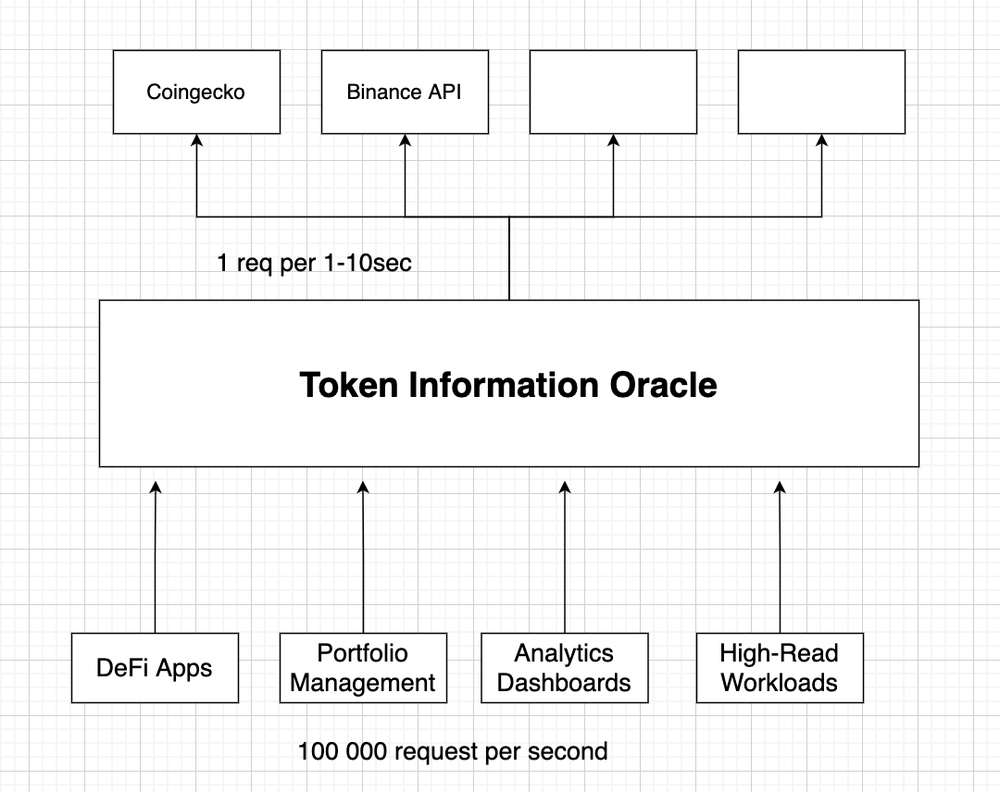

# Token Information Oracle

The Token Price Oracle Service is a high-performance, asynchronous API designed to provide accurate and real-time token price data. This service integrates seamlessly with multiple data sources, ensuring reliability, scalability, and flexibility for developers building applications that require up-to-date cryptocurrency price information.




## Key Features

 1. **Asynchronous API**

    The service is built using modern asynchronous Rust libraries to handle high-concurrency requests efficiently.
    Users can fetch token prices without blocking, allowing for smooth integration into distributed systems or microservice architectures.


2. **Stateless Proof-of-Work (PoW)  DDoS Protection system.**

    By utilizing cryptographic techniques, it ensures that only clients expending computational effort can proceed, deterring abusive requests. 
    This approach is efficient, scalable, and configurable, offering flexibility to enable or disable protection based on operational requirements.


3. **Integration with Multiple Data Sources**

    Connects to multiple cryptocurrency exchanges, market aggregators, and data providers to fetch live and historical price data.
    Utilizes redundancy by querying multiple sources, ensuring high availability and accuracy even if one provider is down.


4. **Real-Time Price Updates**

    Supports WebSocket and HTTP APIs for continuous price feeds or on-demand queries.
    Ensures low latency in delivering updates to keep your application in sync with market changes.


5. **Advanced Caching System**

    Implements an intelligent in-memory caching layer to handle a large number of concurrent readers efficiently.
    Reduces the number of external API calls to data providers, significantly cutting operational costs.
    Configurable cache expiration to balance data freshness with performance.
    Particularly beneficial for applications with heavy read traffic, ensuring high performance while minimizing API provider expenses.


6. **Customizable Aggregation Logic**

    Offers configurable algorithms for price aggregation (e.g., weighted averages, median pricing).
    Allows developers to fine-tune how prices are calculated from different data sources based on their application's requirements.


7. **Secure and Scalable**

    Implements secure communication channels (e.g., HTTPS, token-based authentication) for API usage.
    Scales horizontally to handle a growing number of requests and maintain performance under heavy loads.


## Example Use Cases

1. **DeFi Applications**

   Fetch real-time prices for on-chain token swaps, lending, or liquidity pool management.


2. **Portfolio Management**

    Provide users with live token valuations and historical price trends.


3. **Analytics Dashboards**

    Aggregate and visualize token price movements for traders and investors.


4. **High-Read Workloads**

    Use the advanced caching system to efficiently serve thousands of simultaneous requests while minimizing costs.


### WebSocket (todo)

Subscribe to real-time price updates with a customizable feed (e.g., specific tokens or exchanges).


## Benefits of the Service

1. Accuracy: By aggregating data from multiple reliable sources, the service minimizes the risk of price manipulation or inaccuracies.
2. Efficiency: Built-in caching and asynchronous processing enable high throughput and low response times.
3. Cost Savings: The advanced caching system optimizes for high-read scenarios, reducing the reliance on external APIs and significantly lowering costs for frequent access.
4. Flexibility: Easy integration into applications of varying scale and complexity.
5. Scalability: Designed to grow with your needs, handling thousands of concurrent users and API calls.

The Token Price Oracle Service is your dependable solution for accessing accurate, real-time cryptocurrency price data while minimizing costs for high-demand applications.


## Road Map

1. MVP Solution. Getting price data for btc/eth tokens from the 1 source (coingeko). Store data only in the runtime custom cash. (Done)
2. Add ability to configur list of tokens, coingeko keys, time intervals in the config file. Add unit tests. (Done)
3. Implement DDoS Protection system  (Done) 
4. Develop client to emulate full business process. (Done)
4. Add light weight DB to store data and provide historical price data.
4. Add ability to work with multiple proxies to bypass request limits. 
5. Integrate more data sources


## API Overview

### HTTP Endpoints Oracle

1) **Fetch the latest price for all token.**

**Request:**
- **Method:** GET
- **Endpoint:** `/prices`


**Request example:**

Header (If ddos protection enabled) :

X-Access-Token:
```json
{"access_token": "access_0938b24f-80ee-4669-bc2d-1df2d7c4c2c0","signature": "aa3aff15432f68286e9c60f3cef1d82f173aca54fcec6158d5a29ee04ca02723"}
```

**Response example:**
```
{[
  { token_ticker: "ethereum", price_list: [{ currency: "usd", price: "3649.95" }] }, 
  { token_ticker: "bitcoin", price_list: [{ currency: "usd", price: "96991" }] }
]}
```      


2)  **Fetch the latest price for a specific token. (todo)**

**Request:**
- **Method:** GET
- **Endpoint:** `/price/{token}`


### HTTP Endpoints Puzzle Service

1)  **Get task**

**Request:**
- **Method:** GET
- **Endpoint:** `/puzzle/get_task`


**Response example:**
```json
{
"task": "dcb891a4-11ae-4a8f-a45e-f9a4b5e7f330",
"signature": "f9071a790bd757e269224b010a1b1403dd5ded374bf871f77a76f80e1a739d5e",
"difficulty": 1
}
```

2) **Check resolution and recived access token.**

**Request:**
- **Method:** POST
- **Endpoint:** `/puzzle/check_resolution `

**Request example:**

```json
{
"task": "dcb891a4-11ae-4a8f-a45e-f9a4b5e7f330",
"nonce": 10,
"signature": "f9071a790bd757e269224b010a1b1403dd5ded374bf871f77a76f80e1a739d5e"
}
```

**Response example:**

```json
{
"access_token": "access_1a6597f0-617c-4abb-bd9b-f47b1e00e9b3",
"signature": "0acd1487703345a366aafb897035bd9b002e6cedd5f0a999b74a11ce7946296e"
}
```


## How to run

1) **Configure token oracle**
- token_oracle/config.toml (Puzzle configuration)
- token_oracle/coingecko_conf_test/prod.toml (Access to the Coingecko and data structure)

2) **Configure client**
- client/config.toml

3) **Run Token Oracle**

```sh
cd token_oracle
```

Run with test config
```sh
APP_ENV=test cargo run
```

Run with prod config
```sh
APP_ENV=prod cargo run
```

3) **Run Client**

```sh
cd client
```

```sh
cargo run
```

